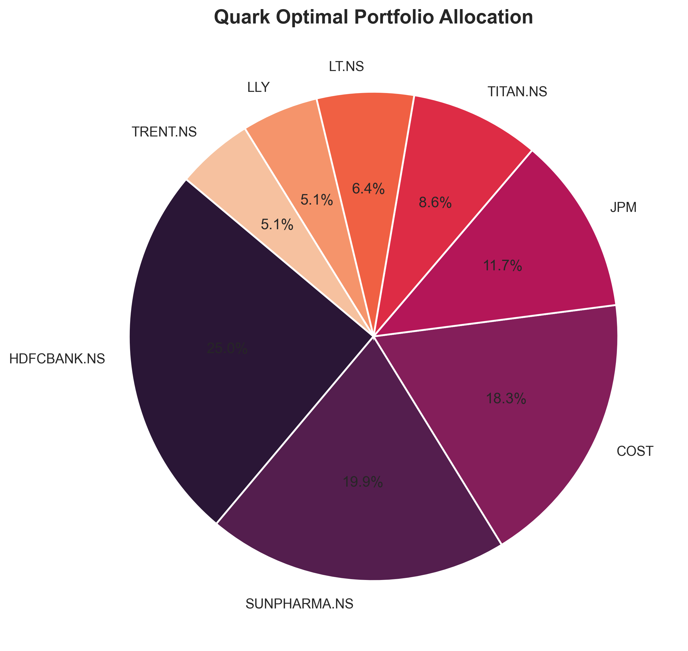
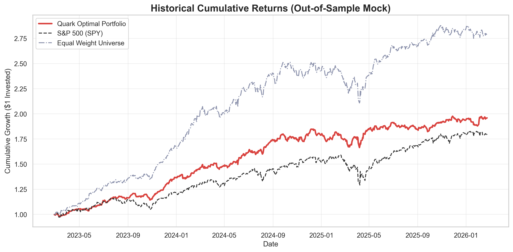

<div align="center">
  
  <h1>🌌 Quark Optim </h1>
  
  <p><strong>Institutional-Grade PyTorch-Accelerated Firefly Portfolio Optimization Engine</strong></p>

  <p>
    <a href="https://github.com/Anagatam/Quark/actions/workflows/ci.yml">
      
    </a>
    <a href="https://pypi.org/project/quark-optim/">
      
    </a>
    <a href="https://opensource.org/licenses/Apache-2.0">
      
    </a>
    <a href="https://www.python.org/downloads/">
      
    </a>
    <a href="https://pytorch.org/">
      
    </a>
  </p>
</div>

---

Traditional solvers (like SciPy's SLSQP) consistently fail or become trapped in local minima when confronted with realistic institutional constraints (Strict Cardinality, Absolute Bounds, Non-differentiable $CVaR$). **Quark** completely bypasses mathematical limitations by simulating highly dimensional swarms of biological "Fireflies" utilizing Heavy-Tailed **Mantegna's Levy Flights**. These entities jump aggressively across the non-convex objective space simultaneously over PyTorch Tensors, ensuring convergence on the *true* Global Optimum.

---

## 🚀 The Google-Tier Architecture

### 1. `SwarmTensor` GPU Accelerator
Quark's core evolutionary loops are fully vectorized into multidimensional `torch.Tensor` architectures. When deployed to CUDA/Apple Metal hardware, thousands of Firefly position permutations are calculated simultaneously, slashing NP-Hard search times from hours down to milliseconds.

### 2. Deep Denoising Autoencoder
Instead of relying on fragile historical sample covariances, Quark utilizes PyTorch deep learning to map empirical returns through a non-linear Latent Space Bottleneck. The engine distills idiosyncratic variance and recovers a perfectly denoised, structurally stable `cov_matrix_`.

### 3. Institutional Mathematics ($Luminescence$)
The `luminescence` module implements peer-reviewed quantitative mathematics designed for absolute preservation of Tier-1 capital:
- **Random Matrix Theory (RMT)**: Eigenvalue clipping utilizing Marchenko-Pastur distribution bounds ensures strict Positive Definiteness (PD).
- **Black-Litterman Synthesis**: Harmonically blends Deep Learning expected returns with Market-Implied global equilibrium priors.
- **Conditional Value-at-Risk ($CVaR$)**: Optimizes strictly against the 5% worst-case left-tail distribution.

---

## 📊 Performance Benchmarks (Global Cross-Market)

By merging US Large-Cap growth stocks with the Indian NIFTY 50, Quark discovers pristine global hedging structures out-of-sample.

<div align="center">
  
</div>
<br/>
<div align="center">
  
</div>

---

## ⚡ Quickstart Guide

### Installation
You can easily install Quark directly from PyPI or build from source.

```bash
pip install quark-optim

# Development Build
git clone https://github.com/Anagatam/Quark.git
cd Quark
make install
```

### The Beautiful API (`.illuminate(X)`)

We meticulously designed the `MasterQuark` facade to align perfectly with the Scikit-Learn estimator syntax. We also provide a built-in `QuarkDataLoader` to effortlessly fetch and synchronize cross-market datasets!

```python
from quark.facade import MasterQuark
from quark.data.loader import QuarkDataLoader

# 1. Fetch & Synchronize a Global Universe via Quark's Native Loader
tickers = [
    "NVDA", "MSFT", "META", "LLY",       # US Heavyweights
    "HDFCBANK.NS", "NTPC.NS", "SUNPHARMA.NS" # Indian NIFTY 50
]
loader = QuarkDataLoader(tickers, start_date="2021-01-01", end_date="2024-01-01")
prices_df = loader.fetch()

# 2. Instantiate the PyTorch Metaheuristic Optimizer
model = MasterQuark(
    objective_type='composite', # Balances Alpha, Volatility, CVaR, & Max Drawdown
    max_assets=4,               # Strict non-convex Cardinality Constraint (Must purely select 4)
    lower_bound=0.05,           # Minimum 5% Allocation per selected stock
    upper_bound=0.40,           # Maximum 40% Allocation 
    num_fireflies=100,          # Size of the Biological Swarm
    max_iterations=150          # Evolutionary Generations
)

# 3. Absorb Market Physics and Optimize
model.illuminate(prices_df)

# 4. View Institutional Metrics
print("\\n✨ Optimal Weights:")
for ticker, weight in model.metrics_['optimal_weights'].items():
    print(f"  - {ticker}: {weight:.2%}")

print(f"\\n📈 Projected Annualized Return: {model.metrics_['annualized_return']:.2%}")
print(f"📉 Max Historical Drawdown: {model.metrics_['max_drawdown']:.2%}")
```

---

<div align="center">
  <br/>
  <p>Engineered with 🔬 by <b>Anagatm Technologies</b></p>
</div>
