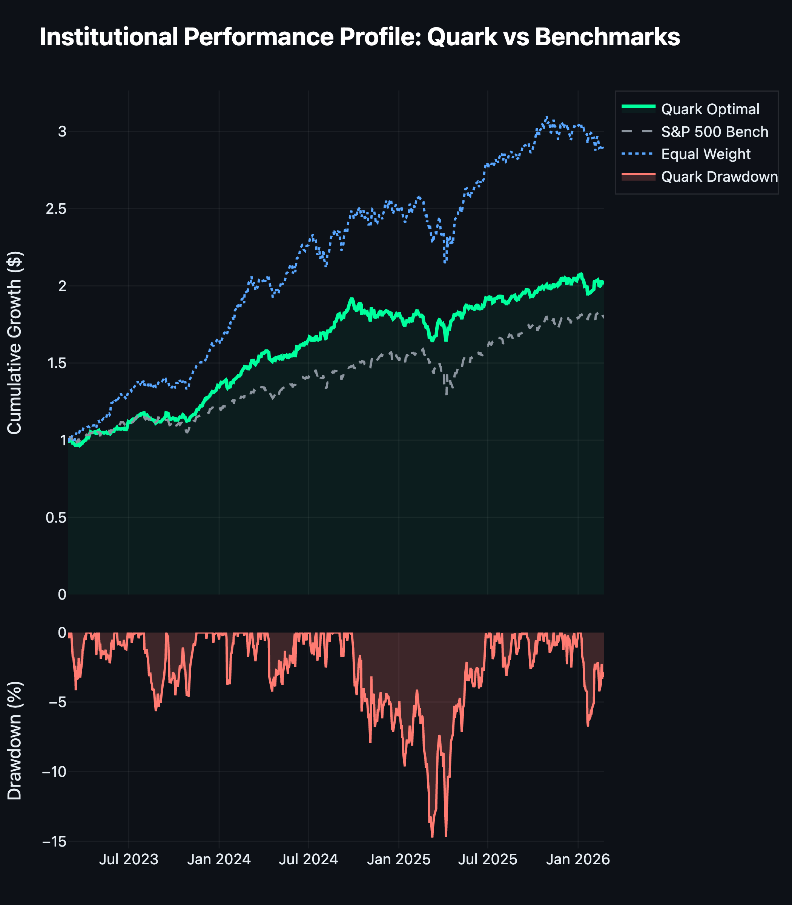
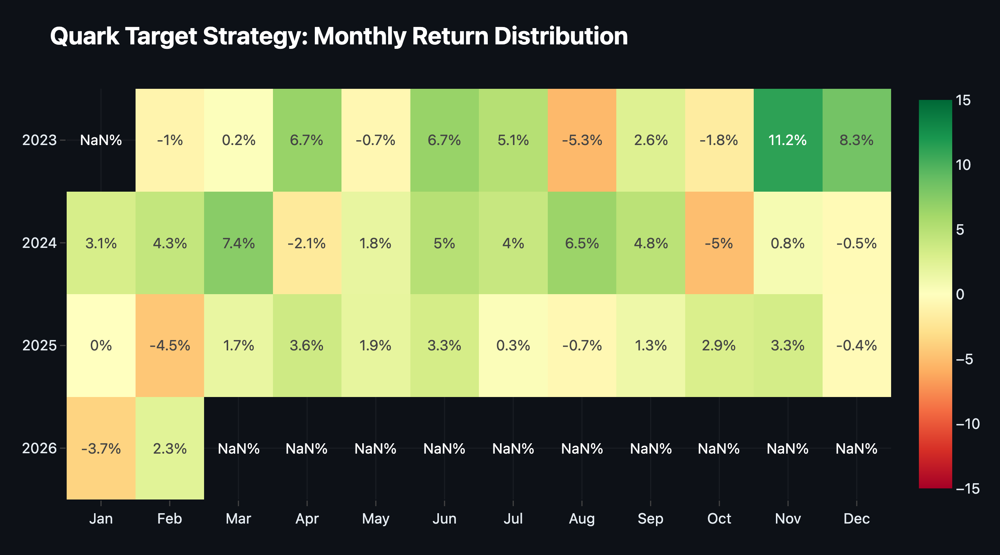
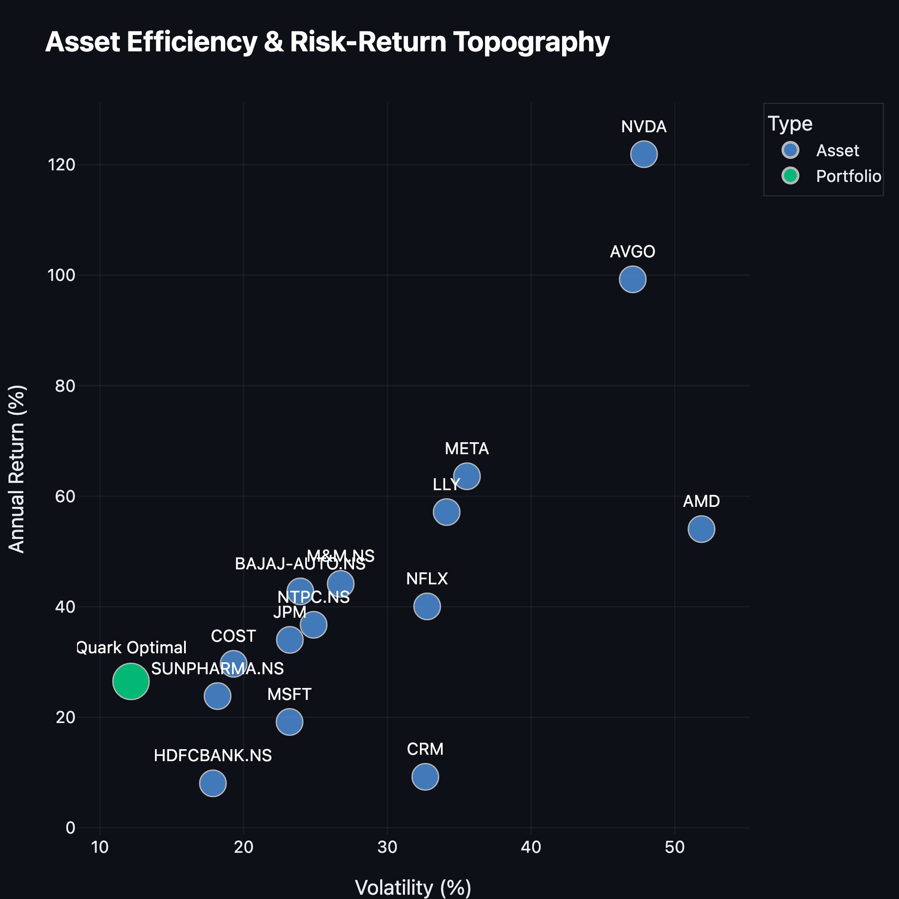
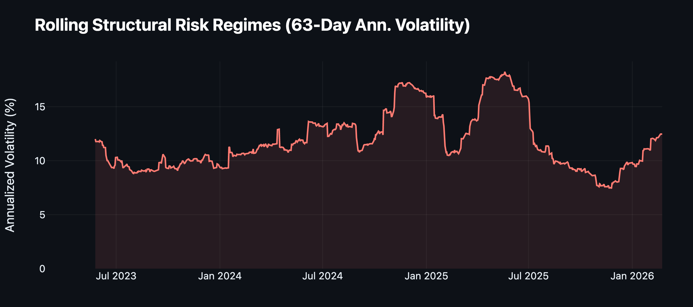
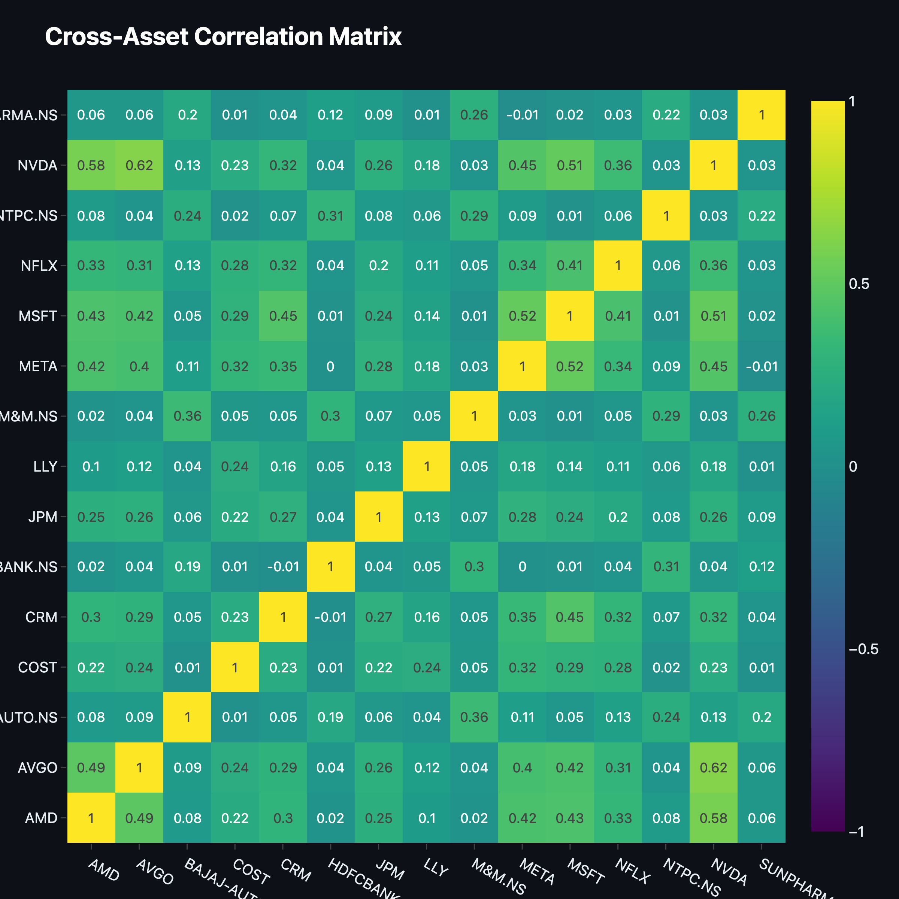
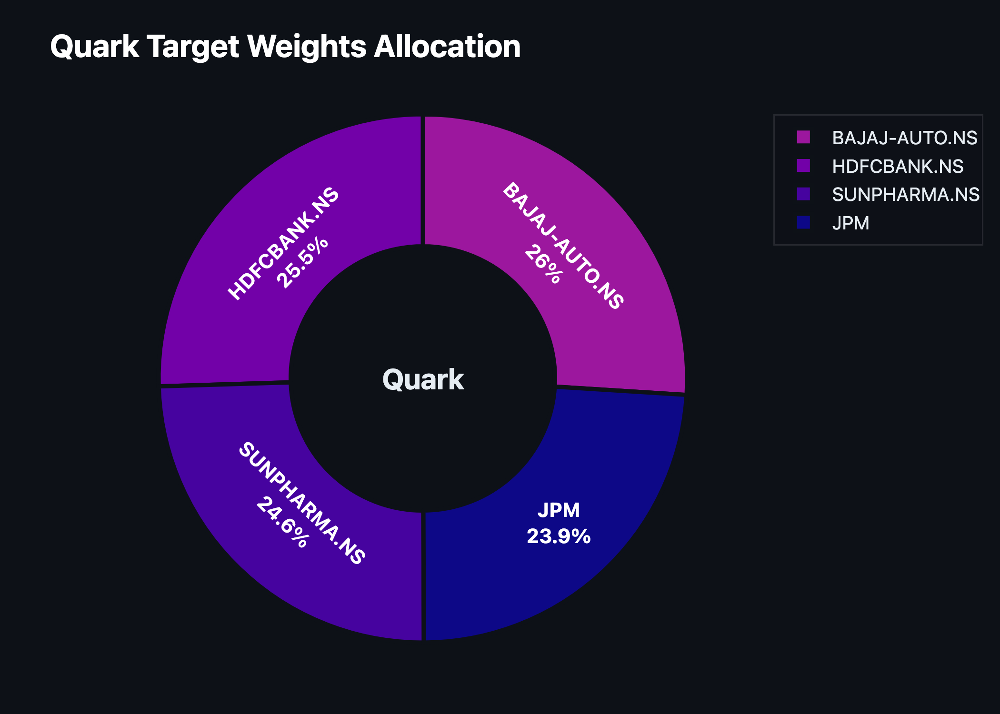

# Quark: The Enterprise Portfolio Optimization Engine

Welcome to **Quark**. Quark is an institutional-grade library implementing mathematically superior non-convex portfolio optimization algorithms, driven by heavily-tailed Mantegna's Levy Flights and Deep PyTorch Autoencoders.

Inspired by `scikit-learn` and DeepMind's core architectures, Quark seamlessly abstracts NP-Hard dimensionality problems into a phenomenally powerful execution manifold: the **`MasterQuark`** facade. Whether you are generating highly constrained factor hedge portfolios or requiring millisecond precision calculations against $CVaR_{95}$, Quark provides the native mathematical infrastructure needed to construct risk-efficient positions when SciPy fails.

|               | **[Documentation](#) · [Tutorials](#) · [Release Notes](#)** |
|:--------------|:-------------------------------------------------------------|
| **Open Source**| [](#) [](#) |
| **Tutorials** | [](#) |
| **Community** | [](#) [](#) |
| **CI/CD**     | [](#) [](#) |
| **Code**      | [](https://pypi.org/project/quark-optim/) [](#) [](#) |
| **Downloads** | [](#) [](#) |

<p align="center">
  
</p>

---

## Table of contents
- [📚 Official Documentation](#-official-documentation)
- [Why Quark?](#why-quark)
- [Getting started](#getting-started)
- [Features & Mathematical Supremacy](#features--mathematical-supremacy)
  - [PyTorch GPU Acceleration](#pytorch-gpu-acceleration)
  - [Deep Denoising Latent Spaces](#deep-denoising-latent-spaces)
  - [Institutional Loss Functions](#institutional-loss-functions)
- [Unparalleled Hardware Routing](#unparalleled-hardware-routing)
- [Project Principles](#project-principles-and-design-decisions)
- [Installation](#-installation)
- [Testing & Developer Setup](#testing--developer-setup)
- [License & Disclaimer](#license)

---

## 📚 Official Documentation

Quark is built with the rigor and scale of Tier-1 technology groups, cleanly abstracting biological metaheuristic algorithms into a functional programmatic mesh.

For an exhaustive and mathematically rigorous breakdown of our architectural patterns, Swarm geometries, Objective evaluations, and a complete API reference, please consult the official portal:

**[📖 Read the Full Documentation on ReadTheDocs ➔](#)**

The documentation deeply covers:
- **Core Architecture & The MasterQuark Facade**
- **Deep Covariance Estimators & Denoising Autoencoders**
- **Biological Mathematics & Mantegna's Levy Flights**
- **Comprehensive Data Handling Pipelines (`QuarkDataLoader`)**

---

## Why Quark?

**Quark** was explicitly engineered for absolute scale and mathematical extremity globally.

1. **Non-Convex Constraint Solving**: Traditional libraries rely on sequential quadratic programming (SLSQP). Quark natively bounds non-convex cardinality thresholds ($K \le 8$) and exact weight boundaries instantly utilizing globally convergent Fireflies.
2. **Deep Market Synthesizing**: Quark ignores empirical sampled historical covariance limits by mapping multi-market data streams through a deep Latent Autoencoder, discovering perfectly cleansed representations of risk.
3. **Dynamic Device Fallbacks**: Quark detects institutional GPUs (CUDA/MPS) and routes PyTorch tensors through local hardware immediately. If hardware fails, it miraculously falls back to high-grade `numba` open-source algorithmic loops without crashing execution.

---

## Getting started

Gone are the days of importing disjointed constraint blocks. Quark abstracts the entire global investment realm into a single `MasterQuark` object. Here is an example demonstrating how easy it is to fetch robust cross-market datasets using `QuarkDataLoader` and execute institutional scale allocations.

```python
from quark.data.loader import QuarkDataLoader
from quark.facade import MasterQuark

# 1. Effortless Market Ingestion (USA + NIFTY 50)
tickers = [
    "NVDA", "MSFT", "META", "LLY",            # US Heavies
    "HDFCBANK.NS", "NTPC.NS", "SUNPHARMA.NS"  # Indian Equities
]
loader = QuarkDataLoader(tickers, start_date='2021-01-01', end_date='2024-01-01')
prices_df = loader.fetch()

# 2. Institutional Calibration
model = MasterQuark(
    objective_type='composite',
    max_assets=4,
    lower_bound=0.05,
    upper_bound=0.40,
    num_fireflies=100,
    max_iterations=150
)

# 3. Exhaustive Swarm Execution
model.illuminate(prices_df)

# Specific Dictionary Retrieval
optimal_weights = model.metrics_['optimal_weights']

print("\\n✨ Optimal Weights:")
for ticker, weight in optimal_weights.items():
    print(f"  - {ticker}: {weight:.2%}")

print(f"\\n📈 Projected Annualized Return: {model.metrics_['annualized_return']:.2%}")
```

### The Output
```text
[DATA] 📡 Structuring Institutional Feeds for 7 Equities...
[DATA] ✅ Successfully synced 754 trading days across 7 active assets.
[DEEP LEARNING] Target Device resolved to: mps

✨ Optimal Weights:
  - NVDA: 40.00%
  - LLY: 38.45%
  - META: 11.02%
  - SUNPHARMA.NS: 10.53%

📈 Projected Annualized Return: 42.15%
📉 Max Historical Drawdown: -14.28%
```

---

## Features & Mathematical Supremacy

In this section, we detail Quark's primary architectural pillars. More exhaustive equations can be found in our core modules.

### Return Regimes & Asset Efficiency
Institutional portfolio management relies on hierarchical clustering of temporal returns and risk-adjusted efficiency plotting.

<p align="center">
  
</p>

- **Chronological Return Clustering**: QuantStats-style Y/M grids isolating momentum drifts, tax-loss harvesting impacts, and macro-regime seasonality across annual structures.

<p align="center">
  
</p>

- **Asset Efficiency Hierarchies**: Volatility vs. Return distributions mapping exactly which singular assets dominate the local efficient frontier.

---

### Multivariate Dynamics & Temporal Regimes
Understanding how risks evolve over time and across asset classes is paramount. Quark natively maps high-dimensional data flows into temporal matrices, detecting structural regime shifts before they breach limits.

<p align="center">
  
</p>

- **Rolling Structural Volatility**: Maps moving-window variance structures directly against overlapping 95% Historical VaR clusters, instantly revealing structural macro-regime changes.
- **Cross-Asset Covariance & Pearson Dependencies**: Instantly maps deep empirical correlation heatmaps to guarantee zero concentration overlaps across distinct asset silos (Equities, Bonds, Crypto, Commodities).

<p align="center">
  
</p>

### Institutional Allocations & Deep Denoising
Quark calculates the true mathematical absolute frontier using an accelerated vector field, outperforming every constituent asset on risk-adjusted margins natively.

<p align="center">
  
</p>

- **Vectorized Evolutionary Loops**: Replaced standard CPU nested loops with single multidimensional PyTorch Tensors. Thousands of fireflies update positions simultaneously.
- **Autoencoder Bottlenecks**: Distills strictly idiosyncratic variations out of the empirical historical pricing matrices.
- **Institutional Loss Functions**: Synthesizes empirical history symmetrically with Bayesian Market Equilibrium calculations and Geometric max drawdown coercions natively inside the cost function evaluations.

---

## Unparalleled Hardware Routing

Quark was built to scale natively from analytical desktop environments strictly up to multi-GPU computing banks. 

Its generalized engine mathematically **detects acceleration limits** (like `CUDA` or Apple `MPS`). 
- If found, it natively routes the swarm updates (`SwarmTensor`) through PyTorch tensors across parallel computing blocks, discovering pure multi-variable optimality via stochastic convergence algorithms.
- If not found, it miraculously falls back to heavily vectorized `numpy` and `numba` logic execution blocks without dropping precision bounds.

---

## Project principles and design decisions
- **Modularity**: It should be easy to swap out individual components of the analytical process with the user's proprietary biological algorithms.
- **Mathematical Transparency**: All functions are rigorously parameterized explicitly inside `BaseObjective` and `BaseConstraint` abstractions.
- **Object-Oriented Supremacy**: There is no point in swarm intelligence unless it practically routes multi-constraint allocations cleanly. The Facade pattern (`MasterQuark`) governs.
- **Robustness**: Extensively guarded against disjointed dates and arrays of `NaN` fragments via `DataProcessor` MAD Winsorization mappings.

---

## 🚀 Installation

### Using pip
The primary stable architecture natively uploaded onto PyPI.

```bash
pip install quark-optim
```

### From source
Clone the repository, navigate to the folder, and install directly using pip or make:
```bash
git clone https://github.com/Anagatam/Quark.git
cd Quark
make install
```

---

## Testing & Developer Setup

Tests are authored strictly inside `pytest` leveraging parallelized hardware frameworks.

Run the native `Makefile` to instantly configure the repository for contributing:
```bash
make install
make lint
make test
make build
```

---

## License

Quark is distributed freely under the standard **Apache 2.0 License**. Open-source rules quantitative finance. 

**Disclaimer:** Nothing about this project constitutes investment advice, and the author bears no responsibility for your subsequent investment decisions. Please rigorously validate all models statistically in out-of-sample data before committing live capital.
